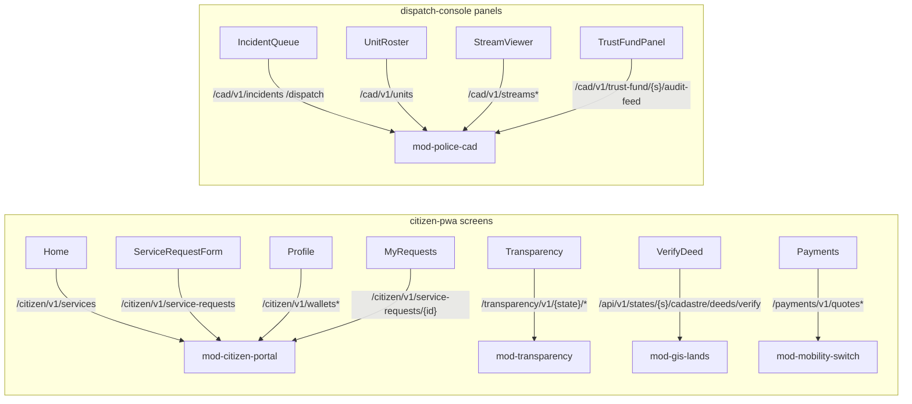
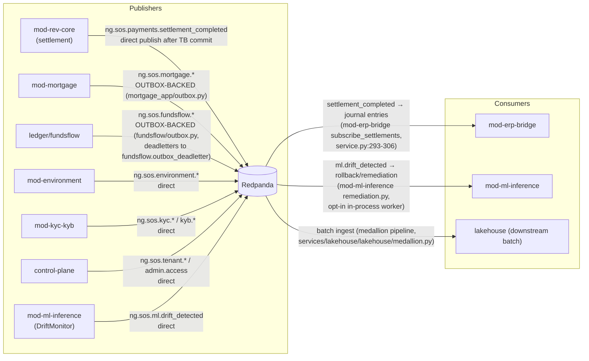
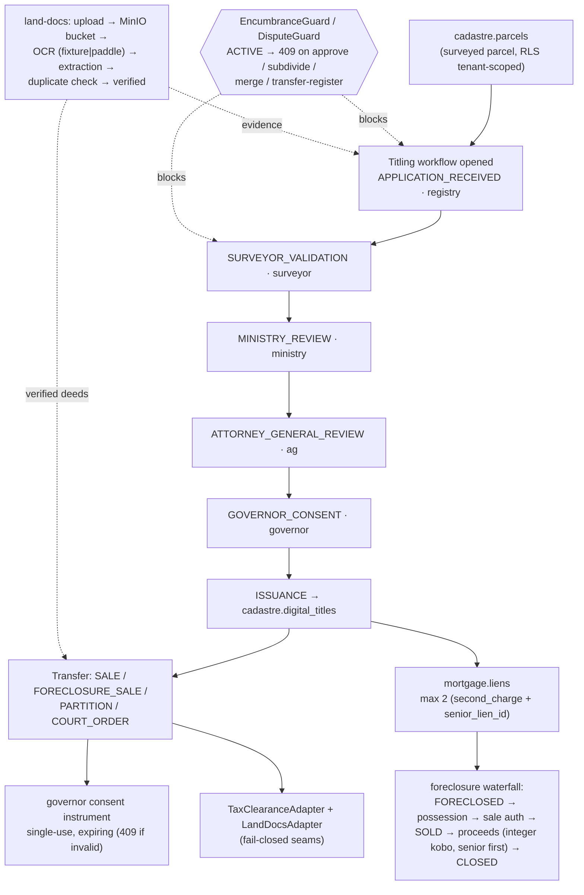
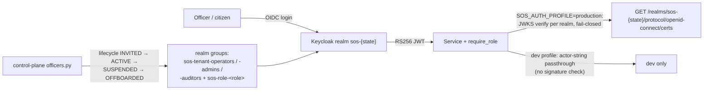

# Data Flow Map — Unified SOS Platform

The definitive engineer-facing map of how data moves through the platform:
edge → gateway → services → persistence → events → money paths. Every claim
below is traceable to a file in this repo; file references are inline.

Scope note: this document describes the **current code**, not target-state
slides. Where a seam is in-memory by default and needs a production env flip,
that is stated explicitly and consolidated in the
[data-loss-risk register](#7-data-loss-risk-register).

---

## 1. System context

Channels terminate at the Caddy edge, which terminates TLS per state vhost
and hands API traffic to APISIX, which fans out by path prefix to services.
Source files: `deploy/caddy/Caddyfile` (generated by
`deploy/caddy/generate_caddyfile.py`), `deploy/tuning/apisix-routes.generated.yaml`
(generated by `deploy/tuning/generate_apisix_routes.py`),
`deploy/docker-compose.yml` (port bindings).

```mermaid
flowchart TB
    subgraph channels["Channels"]
        pwa["Citizen PWA<br/>(apps/citizen-pwa, host :3001 → container :3000)"]
        cad["Dispatch console<br/>(apps/dispatch-console)"]
        ussd["USSD / IVR telco webhooks<br/>(POST /channels/*)"]
        nibss["NIBSS e-Bills gateway<br/>(bill issue + payment webhook)"]
        fspiop["FSPIOP / Mojaloop scheme callbacks<br/>(transfer prepare / fulfil)"]
        erp["ERP / SAP inbound<br/>(POST /erp/* journal pull/push)"]
        browser["State-subdomain browsers<br/>(sos.&lt;state&gt;state.gov.ng)"]
    end

    subgraph edge["Caddy edge (deploy/caddy/Caddyfile)"]
        caddy["Caddy :8080 http / :8443 tls<br/>per-state vhosts, WAF-lite headers,<br/>no-store on /payments/* and /mobility/*"]
        ask["on-demand TLS ask<br/>GET /cp/v1/domains/allowed → control-plane:8000"]
    end

    subgraph gw["APISIX gateway :9080 (deploy/tuning/apisix-routes.generated.yaml)"]
        apisix["Path-prefix fan-out + per-tenant limit-count<br/>(keyed on X-Sos-Tenant-State header)"]
    end

    subgraph svc["Services (all container :8000 unless noted)"]
        portal["mod-citizen-portal :8011"]
        transp["mod-transparency :8015"]
        polcad["mod-police-cad :8027"]
        mobility["mod-mobility-switch :8026"]
        cp["control-plane :8024"]
        lands["mod-gis-lands :8000"]
        geo["mod-geospatial :8013"]
        luc["mod-gis-luc :8033"]
        landdocs["mod-land-docs :8022"]
        mort["mod-mortgage :8023"]
        rev["mod-rev-core :8037 (Go, container :8080)"]
        erpb["mod-erp-bridge :8016"]
        ml["mod-ml-inference :8021"]
        sector["sector services<br/>agri-trace :8018 · agri-waybill :8034 · border-transit :8019<br/>education :8031 · environment :8010 · forestry :8030<br/>health :8032 · identity :8025 · kyc-kyb :8012<br/>market :8028 · mining :8029 · ppp-investment :8035<br/>safecity-vision :8017 · transport-wim :8036 · waterways :8020"]
    end

    pwa --> caddy
    cad --> caddy
    ussd --> caddy
    nibss --> caddy
    fspiop --> caddy
    erp --> caddy
    browser --> caddy
    caddy -.->|"cert issuance gate"| ask
    caddy -->|"@api path families, Host preserved"| apisix
    caddy -->|"all other paths"| pwa
    apisix -->|"/citizen/* /channels/*"| portal
    apisix -->|"/transparency/*"| transp
    apisix -->|"/cad/*"| polcad
    apisix -->|"/payments/* /mobility/*"| mobility
    apisix -->|"/cp/* /control/*"| cp
    apisix -->|"/api/v1/states/*/cadastre/*"| lands
    apisix -->|"/api/v1/states/*/geospatial/*"| geo
    apisix -->|"/api/v1/states/*/luc/*"| luc
    apisix -->|"/api/v1/states/*/land-docs/*"| landdocs
    apisix -->|"/api/v1/states/*/mortgages/*"| mort
    apisix -->|"/api/v1/states/*/revenue/*"| rev
    apisix -->|"/erp/*"| erpb
    apisix -->|"/ml/*"| ml
    apisix -->|"per-service prefixes"| sector
```

Facts behind the diagram:

- Caddy vhosts are generated one per state (`# --- abia ---`, `# --- adamawa ---`, …
  in `deploy/caddy/Caddyfile`); each proxies the `@api` path family set
  `/api/* /citizen/* /transparency/* /cad/* /payments/* /cp/* /mobility/* /erp/* /ml/*`
  to `apisix:9080` with `header_up Host {host}`, and everything else to the
  `citizen-pwa:3000` static build. Money paths get `Cache-Control: no-store`.
- On-demand TLS: `on_demand_tls { ask http://control-plane:8000/cp/v1/domains/allowed }`
  with `interval 2m / burst 5`; the fallback block uses `tls { on_demand }`.
  The control-plane answers 200 only for registered tenant `custom_domain`s.
- APISIX routes carry per-tenant `limit-count` plugins keyed on the
  `X-Sos-Tenant-State` header; upstreams are one per service plus the
  `sos-platform` catch-all (`control-plane.sos-platform.svc.cluster.local:8000`).
  65 route entries exist in the generated file.

---

## 2. Frontend → backend map

API clients: `apps/citizen-pwa/src/lib/api.ts` (base `VITE_API_BASE_URL`),
`apps/dispatch-console/src/lib/api.ts` (base `VITE_API_BASE`). Both are
fail-soft: unreachable API → deterministic fixtures ("demo mode"); mutating
PWA calls fall through to the offline queue
(`apps/citizen-pwa/src/lib/offlineQueue.ts`).

| UI surface | File | Call | API path family | Service : host port |
|---|---|---|---|---|
| State selector | `screens/StateSelector.tsx` | branding/state config | static / store | — (client-side) |
| Home — service catalog | `screens/Home.tsx` | `listServices` | `GET /citizen/v1/services` | mod-citizen-portal :8011 |
| Profile — create wallet | `screens/Profile.tsx` | `createWallet` | `POST /citizen/v1/wallets` | mod-citizen-portal :8011 |
| Profile — wallet read | `screens/Profile.tsx` | `getWallet` | `GET /citizen/v1/wallets/{id}` | mod-citizen-portal :8011 |
| Service request form | `screens/ServiceRequestForm.tsx` | `submitServiceRequest` | `POST /citizen/v1/service-requests` (offline-queue fallback) | mod-citizen-portal :8011 |
| My requests | `screens/MyRequests.tsx` | `getServiceRequest` | `GET /citizen/v1/service-requests/{id}` | mod-citizen-portal :8011 |
| Transparency — trust fund | `screens/Transparency.tsx` | `trustFundFeed` | `GET /transparency/v1/{state}/trust-fund/feed` | mod-transparency :8015 |
| Transparency — escrow | `screens/Transparency.tsx` | `escrowStatements` | `GET /transparency/v1/{state}/escrow/statements` | mod-transparency :8015 |
| Transparency — procurement audit | `screens/Transparency.tsx` | `procurementAudit` | `GET /transparency/v1/{state}/procurement/audit` | mod-transparency :8015 |
| Transparency — audit verify | `screens/Transparency.tsx` | `procurementAuditVerify` | `GET /transparency/v1/{state}/procurement/audit/verify` | mod-transparency :8015 |
| Verify deed | `screens/VerifyDeed.tsx` | `verifyDeed` | `POST /api/v1/states/{state}/cadastre/deeds/verify` | mod-gis-lands :8000 |
| Payments — quote | `screens/Payments.tsx` | `requestPaymentQuote` | `POST /payments/v1/quotes` | mod-mobility-switch :8026 |
| Payments — confirm | `screens/Payments.tsx` | `confirmPayment` | `POST /payments/v1/quotes/{quote_id}/confirm` | mod-mobility-switch :8026 |
| Incident queue | `components/IncidentQueue.tsx` | `listIncidents` | `GET /cad/v1/incidents` | mod-police-cad :8027 |
| Unit roster | `components/UnitRoster.tsx` | `listUnits` | `GET /cad/v1/units` | mod-police-cad :8027 |
| Dispatch action | `components/IncidentQueue.tsx` | `dispatchUnit` | `POST /cad/v1/dispatch` | mod-police-cad :8027 |
| Stream viewer | `components/StreamViewer.tsx` | `listStreams` / `openStreamSession` | `GET /cad/v1/streams` · `POST /cad/v1/streams/{id}/session` | mod-police-cad :8027 |
| Trust-fund panel | `components/TrustFundPanel.tsx` | `trustFundAuditFeed` | `GET /cad/v1/trust-fund/{state}/audit-feed` | mod-police-cad :8027 |
| Map panels | `components/MapPanel.tsx`, `MapLibrePanel.tsx`, `Cadastre3D.tsx` | layer/tile helpers in `lib/mapLayers.ts`, `lib/mapcore.ts` | static/tile assets (no service call in `api.ts`) | — |

---

## 3. Service → persistence map

Middleware running in compose (`deploy/docker-compose.yml`):

| Middleware | Image / port | Used by (verified seam) |
|---|---|---|
| Postgres (PostGIS) | `postgis/postgis:16-3.4` :5432 | `DATABASE_URL` wired in compose for **mod-gis-lands** and **mod-geospatial** only; all other services default to tenant-scoped in-memory stores with repository seams |
| Redis | `redis:7-alpine` :6379 | named as the production idempotency store seam in `mod-mobility-switch/app/domain.py` (store docstring: "Production: Redis + TigerBeetle + Mojaloop"); no service code imports a redis client today |
| TigerBeetle | `ghcr.io/tigerbeetle/tigerbeetle:0.16.40` :3000 | mod-rev-core (`TB_ADDRESSES: tigerbeetle:3000`), `ledger/fundsflow/tigerbeetle_flows.py`, mod-mortgage opt-in (`SOS_MORTGAGE_LEDGER=tigerbeetle` + `SOS_MORTGAGE_TB_URL`, commented out in compose) |
| Redpanda (Kafka API) | `redpandadata/redpanda:v24.2.7` :9092 | `EVENT_BUS=kafka` + `EVENT_KAFKA_BOOTSTRAP=redpanda:29092` (see per-service defaults below) |
| MinIO | `minio/minio` :9000/:9001 | mod-land-docs object store (`SOS_LANDDOCS_BUCKET`, `SOS_LANDDOCS_S3_ENDPOINT=http://minio:9000`) |
| OpenSearch | `opensearch:2.16.0` :9200 | control-plane audit archive (`OPENSEARCH_URL=http://opensearch:9200`, `OpenSearchArchive`, 7-year retention) |
| MLflow | :5000 | mod-ml-inference (`SOS_MLFLOW_TRACKING_URI=http://mlflow:5000`, fail-closed without it in production profile) |
| Keycloak | `keycloak:26.0` :8081 (host) → :8080 | per-state realms `sos-{state}` (`deploy/keycloak/realms/realm-sos-*.json`); JWKS URL template in `services/_shared/auth.py` |

Per-service persistence (migrations live in `db/migrations/0001`–`0012`;
all tenant tables have `ENABLE ROW LEVEL SECURITY` — 94 RLS statements total):

| Service | DB schema / tables | Migrations | Middleware / DSN env seam | Event bus default (compose) | Outbox | Fail-closed profile vars |
|---|---|---|---|---|---|---|
| mod-gis-lands | `cadastre.parcels`, `cadastre.digital_titles`, `titling_workflows`, `titling_transitions` | 0001, 0003 | Postgres `DATABASE_URL` (wired) | `kafka` | no | `SOS_AUTH_PROFILE=production` + `SOS_AUTH_JWKS_URL` |
| mod-gis-luc | `luc.valuation_runs`, `luc.bills` | 0003 | repository seam (in-memory default) | memory (not in kafka list) | no | `SOS_AUTH_PROFILE` |
| mod-rev-core (Go) | `revenue.taxpayers`, `revenue.assessments` | 0002 | TigerBeetle `TB_ADDRESSES`; NIBSS `NIBSS_EBILLS_URL` (`HTTPEBillNotifier`, fail-closed in `nibss` mode) | n/a (Go, webhook-driven) | settlement record persisted BEFORE ledger commit (`service.go:330`) | NIBSS mode requires URL |
| mod-environment | `environment.*` (8 tables: alerts, incidents, permits, telemetry, EIA, carbon) | 0004 | in-memory default | kafka | no | `SOS_AUTH_PROFILE` |
| mod-citizen-portal | `citizen.*` (8 tables incl. `service_requests`, `identity_wallets`, `payroll_audits`) | 0004 | Keycloak `KEYCLOAK_BASE_URL`; repository seam | memory | no | `SOS_AUTH_PROFILE` |
| mod-kyc-kyb | `kyc_kyb.*` (11 tables) | 0005 | adapter seams (`adapters/base.py` fail-closed idiom) | `kafka` | no | `SOS_AUTH_PROFILE` |
| mod-geospatial | `geospatial.*` (7 tables) | 0006 | Postgres `DATABASE_URL` (wired) | `kafka` | no | `SOS_AUTH_PROFILE` |
| mod-identity | `identity.*` (8 tables) | 0007 | repository seam | `memory` | no | `SOS_AUTH_PROFILE` |
| mod-land-docs | `land_docs.documents`, `document_versions`, `duplicate_candidates`, `audit_records` | 0008 | MinIO via `SOS_LANDDOCS_BUCKET` / `SOS_LANDDOCS_S3_ENDPOINT`; OCR via `SOS_LANDDOCS_OCR_ENGINE=fixture\|paddle` + `SOS_LANDDOCS_OCR_URL` (fail-closed) | memory | no | OCR engine refuses to run unconfigured |
| mod-mortgage | `mortgage.*` (6 tables) | 0009 | opt-in TB ledger (`SOS_MORTGAGE_LEDGER=tigerbeetle`, `SOS_MORTGAGE_TB_URL=tb://tigerbeetle:3000`); credit scoring URL default → mod-ml-inference | `memory` | **yes** — `mortgage_app/outbox.py`, outbox row appended atomically with each domain transition, `OutboxRelay` delivers+acks | `SOS_MORTGAGE_PROFILE=production` + TB/lands URLs |
| mod-waterways | `waterways.*` (7 tables) | 0010 | repository seam | `kafka` | no | `SOS_WATERWAYS_PROFILE=production` |
| mod-mobility-switch | `mobility.*` (fare_tables, clearing_records, settlement_batches, bill_events, audit_chain) | 0011 | Redis/TB/Mojaloop named as production seam (docstring); hashchain audit in-process | `memory` (compose note: "No shared-event-bus seam in app/ — hashchain audit only") | no (in-service); canonical idempotency mirrors `ledger/fundsflow/idempotency.py` | FSPIOP adapter seam |
| mod-erp-bridge | `erp.journal_entries`, `erp.outbound_records` | 0012 | SAP/ERP outbound seam | **`memory` (compose comment: audit finding 3 — with `EVENT_BUS=kafka` the settlement→journal automation activates)** | no | `SOS_AUTH_PROFILE` |
| mod-border-transit | `border.*` (4 tables) | 0012 | repository seam | `kafka` | no | `SOS_BORDER_PROFILE=production` |
| mod-agri-trace | `agri.trace_hops`, `agri.warehouse_receipts` | 0012 | repository seam | `kafka` | no | `SOS_AGRI_PROFILE=production` |
| mod-agri-waybill / market / mining / forestry / education / health / police-cad / safecity-vision / transport-wim / ppp-investment | `agri`, `market`, `education`, `health`, `police`, `safecity` schemas (0012); mining/forestry/wim/ppp have no 0012 tables | 0012 (partial) | repository seams | mixed: forestry & safecity `kafka`; market/mining/education/identity/police-cad `memory` | no | per-service `SOS_*_PROFILE=production` (e.g. `SOS_CAD_PROFILE`) |
| control-plane | tenant registry, officer lifecycle, admin audit | (control-plane store) | Postgres via `PostgresOperator`; OpenSearch via `OPENSEARCH_URL`; Keycloak admin (`build_keycloak_admin`) | `kafka` | no | `SOS_CP_PROFILE=production` + `SOS_CP_ADMIN_TOKEN` (fail-closed) |
| mod-ml-inference | model registry (MLflow) | — | `SOS_MLFLOW_TRACKING_URI` (fail-closed in production) | `kafka` | no | MLflow URI required |

### Core-domain entity map

Tables from `db/migrations/0001`–`0011` (subset — the load-bearing rows for
land, money, and identity flows):

```mermaid
erDiagram
    CADASTRE_PARCELS ||--o{ TITLING_WORKFLOWS : "parcel_uin"
    TITLING_WORKFLOWS ||--o{ TITLING_TRANSITIONS : "workflow_id"
    TITLING_WORKFLOWS ||--o| DIGITAL_TITLES : "issues"
    CADASTRE_PARCELS ||--o{ ENCUMBRANCES : "parcel_uin"
    CADASTRE_PARCELS ||--o{ MORTGAGE_LIENS : "parcel_uin"
    MORTGAGES ||--o{ MORTGAGE_LIENS : "mortgage_id"
    MORTGAGES ||--o{ MORTGAGE_INSTALLMENTS : "mortgage_id"
    MORTGAGES ||--o{ MORTGAGE_PAYMENTS : "mortgage_id"
    MORTGAGES ||--o{ FORECLOSURE_SALES : "mortgage_id"
    REVENUE_TAXPAYERS ||--o{ REVENUE_ASSESSMENTS : "taxpayer_id"
    CITIZEN_WALLETS ||--o{ SERVICE_REQUESTS : "wallet_id"
    KYC_CASES ||--o{ KYC_REVIEW_TASKS : "case_id"
    KYC_CASES ||--o{ KYC_AUDIT_ENTRIES : "case_id"
    MOBILITY_SETTLEMENT_BATCHES ||--o{ MOBILITY_CLEARING_RECORDS : "batch_id"
    MOBILITY_AUDIT_CHAIN }o--|| MOBILITY_SETTLEMENT_BATCHES : "hash-chained"
    LAND_DOCS_DOCUMENTS ||--o{ DOCUMENT_VERSIONS : "document_id"
    LAND_DOCS_DOCUMENTS ||--o{ DUPLICATE_CANDIDATES : "document_id"
```

(Entity names above are schema-qualified in the SQL: `cadastre.parcels`,
`mortgage.liens`, `revenue.taxpayers`, `citizen.identity_wallets`,
`kyc_kyb.kyc_cases`, `mobility.settlement_batches`,
`land_docs.documents`, etc. Relationship cardinality is inferred from
foreign keys in the migrations and the domain models.)

---

## 4. Event flow

Contracts: `contracts/asyncapi/platform-events.yaml` (+ `forestry-events.yaml`,
`mining-events.yaml`, `mojaloop-transfers.yaml`). The registry
(`contracts/asyncapi/registry/topics.json`, generated by
`contracts/asyncapi/registry/generate.py`) maps **73 channels → topics →
JSON schemas** (69 schema artifacts in `registry/schemas/`; a few channels
share schemas, e.g. repeated `forestry.untagged_timber_alert` /
`mining.consignment_dispatched` entries). One Redpanda topic per channel.

Transport seam: `services/_shared/eventbus/__init__.py` — `InMemoryEventBus`
(default dev/test), `KafkaEventBus` (production, import-guarded `aiokafka`),
`FluvioEdgeBus` (edge seam). Selection: `EVENT_BUS=memory|kafka|fluvio`,
`EVENT_KAFKA_BOOTSTRAP` required for kafka (fail-closed).

Topics grouped by domain (prefix `ng.sos.` elided):

| Domain | Topics |
|---|---|
| tenant lifecycle (7) | `tenant.provisioning_requested`, `tenant.provisioned`, `tenant.provision_step`, `tenant.provision_failed`, `tenant.provision_rollback`, `tenant.suspended`, `tenant.branding_updated`, `policy_pack.activated` |
| payments / fundsflow (4) | `payments.settlement_completed`, `fundsflow.payment_completed`, `fundsflow.saga_failed`, `fundsflow.outbox_deadletter` |
| mortgage (15) | `mortgage.application_received`, `credit_scored`, `approved`, `declined`, `disbursed`, `lien_registered`, `payment_applied`, `defaulted`, `foreclosed`, `possession_registered`, `sale_authorized`, `sold`, `proceeds_distributed`, `discharged`, `closed` |
| lands / gis (4) | `lands.title_transferred`, `lands.title_revoked`, `lands.compensation_paid`, `gis.unassessed_property_discovered` |
| land-docs (4) | `landdocs.document_registered`, `ocr_completed`, `document_verified`, `duplicate_suspected` |
| kyc/kyb (4) | `kyc.case_decision_made`, `kyc.liveness_failed`, `kyb.case_decision_made`, `kyb.registry_verification_completed` |
| environment (2) | `environment.deforestation_alert_raised`, `environment.compliance_violation_raised` |
| agri (4) | `agri.lot_traced_hop`, `warehouse_receipt_issued`, `receipt_pledged`, `receipt_redeemed` |
| border (3) | `border.transit_crossing_recorded`, `levy_assessed`, `tamper_alert` |
| geospatial (4) | `geospatial.dataset_registered`, `processing_job_completed`, `agency_sync_completed`, `geolibre_project_built` |
| mining / forestry (8) | `mining.consignment_dispatched`, `mining.weighbridge_reading`, `forestry.provenance_recorded`, `forestry.untagged_timber_alert` (registry carries duplicate rows for both mining and forestry families) |
| safecity (3) | `safecity.face_match`, `anomaly_detected`, `crowd_alert` |
| ml (2) | `ml.drift_detected`, `ml.model_rolled_back` |
| erp / audit / admin (3) | `erp.journal_pushed`, `audit.genesis`, `admin.access` |

Only two in-repo service consumers exist today: **mod-erp-bridge** subscribes
to `ng.sos.payments.settlement_completed` (`SETTLEMENT_CHANNEL` in
`app/service.py`) and **mod-ml-inference** subscribes to
`ng.sos.ml.drift_detected` (`app/monitoring.py` + `app/remediation.py`; wiring
is opt-in so the fixture profile stays inert). The lakehouse consumes topics
in batch for the medallion pipeline. Note: erp-bridge's subscription only
activates with `EVENT_BUS=kafka` — compose deliberately leaves it on `memory`
(audit finding 3, compose line ~519), so settlement→journal automation is
**off by default**.

A channel `ng.sos.citizen.payroll_audit_completed` was **removed** from the
contract (comment in `platform-events.yaml`) because no publisher exists;
re-adding it requires the publisher (CIT-11).

---

## 5. Money-path deep-dive

Sources: `services/mod-mobility-switch/app/main.py` (quote/confirm),
`services/mod-mobility-switch/app/domain.py` (escrow/settlement),
`services/mod-rev-core/internal/revenue/service.go` (settlement),
`ledger/fundsflow/tigerbeetle_flows.py` (two-phase),
`ledger/fundsflow/eom_sweep.py` (EOM), `ledger/fundsflow/saga.py` +
`outbox.py` + `invariants.py` (recovery), `ledger/fundsflow/idempotency.py`.

Invariants verified in code:

- **Integer kobo everywhere.** All money fields are `*_kobo: int`
  (`amount_kobo`, `fare_kobo`, `gross_amount_kobo` in the AsyncAPI settlement
  payload; mortgage waterfall legs are "integer kobo" per
  `mortgage_app/domain.py:243`). No floats in money paths.
- **Two-phase ledger.** Amounts are reserved with a PENDING transfer chain
  (`flags.linked` → all-or-nothing), then POSTed (commit) or VOIDed
  (rollback). A posted transfer can never be re-voided; a voided one can
  never post (`tigerbeetle_flows.py` module docstring).
- **Settlement record before commit.** rev-core persists a settlement record
  keyed on `sha256(bill_ref)` BEFORE the ledger commit; crash/retry replay
  resumes via `resumeSettlement`; duplicate settles return
  `ALREADY_SETTLED` (409) (`service.go:330-500`).
- **Dual control.** Refunds and corrections require distinct officer +
  approver (`checkDualControl`, `service.go:513`); refunds mirror the
  committed split chain, corrections post compensating entries.
- **Idempotency.** `Idempotency-Key` header on payment confirm
  (`mobility-switch/main.py:413`); canonical SHA-256 request hash mirrors
  `ledger/fundsflow/idempotency.py` in both mobility-switch and waterways.
- **Saga/outbox.** `ledger/fundsflow/saga.py` persists saga state in a
  pluggable store; `outbox.py` relay is at-least-once with consumer dedupe
  via the idempotency key; a recovery scan republishes un-acked rows;
  deadletters go to `ng.sos.fundsflow.outbox_deadletter`.
- **EOM sweep.** `run_eom_sweep` executes accumulated month-end legs as ONE
  linked chain (all-or-nothing) out of the payer clearing account, then a
  deterministic remainder leg zeroes the clearing remainder into the CRF
  account (`CRF_ACCOUNT = 3001`). Run key `EOM|{tenant}|{YYYY-MM}` +
  deterministic transfer IDs make double-runs no-ops; a COMPLETED run record
  is a second fail-closed guard. Temporal-ready (workflow ID = run key).

```mermaid
sequenceDiagram
    autonumber
    participant C as Citizen PWA
    participant MS as mod-mobility-switch :8026
    participant FSP as FSPIOP adapter seam
    participant TEL as Telco gateway
    participant CP as mod-citizen-portal :8011
    participant RC as mod-rev-core :8037 (Go)
    participant NB as NIBSS e-Bills
    participant TB as TigerBeetle :3000
    participant LH as ledger/fundsflow

    rect rgb(30, 40, 60)
    note over C,MS: PWA quote → confirm (/payments/v1/*)
    C->>MS: POST /payments/v1/quotes (ticket_ref, amount_kobo)
    MS->>FSP: quote(quote_id, amount_kobo, payer, tenant)
    FSP-->>MS: fee quote (fixture formula in dev)
    MS-->>C: PaymentQuote (status QUOTED, TTL 600s)
    C->>MS: POST /payments/v1/quotes/{id}/confirm (Idempotency-Key)
    MS->>MS: replay check — same key → same response, expired → 410
    MS->>FSP: transfer_prepare(transfer_id, amount_kobo, ...)
    FSP-->>MS: scheme fulfil / abort
    MS-->>C: COMPLETED
    end

    rect rgb(40, 30, 60)
    note over TEL,CP: USSD payment (telco → citizen-portal)
    TEL->>CP: POST /channels/* (USSD menu state, hashed MSISDN only)
    CP->>CP: auto-provision channel-bound identity wallet (hash-only)
    note right of CP: reference implementation skips settlement<br/>for channel wallets (ussd.py docstring)
    end

    rect rgb(30, 60, 40)
    note over RC,TB: Settlement (assessment → two-phase commit)
    RC->>NB: IssueBill(assessment) — HTTPEBillNotifier, fail-closed w/o NIBSS_EBILLS_URL
    NB-->>RC: POST /api/v1/states/{s}/revenue/payments/webhook
    RC->>RC: persist settlement record sha256(bill_ref) BEFORE commit
    RC->>TB: create PENDING linked split chain (gross → statutory splits)
    alt success
        RC->>TB: POST chain (commit, all-or-nothing)
        RC-->>RP: publish ng.sos.payments.settlement_completed
    else failure / timeout
        RC->>TB: VOID chain (rollback)
    end
    note over RC: crash between record and commit → resumeSettlement<br/>duplicate webhook → 409 ALREADY_SETTLED
    end

    rect rgb(60, 40, 30)
    note over LH,TB: EOM sweep to CRF (ledger/fundsflow/eom_sweep.py)
    LH->>LH: run key EOM|tenant|YYYY-MM — idempotent, COMPLETED run = no-op
    LH->>TB: ONE linked chain: accumulated month-end legs from clearing
    LH->>TB: remainder leg → CRF account 3001 (zeroes clearing)
    end
```

Refund/reversal path: `POST /revenue/refunds` mirrors the committed split
chain (dual-controlled); `POST /revenue/corrections` posts dual-controlled
compensating entries and re-tracks the current allocation so later refunds
use the corrected chain (`service.go:553-714`).

---

## 6. Land / title-path deep-dive

Sources: `services/mod-gis-lands/lands_app/titling.py`, `transfers.py`,
`encumbrances.py`, `disputes.py`, `court_orders.py`, `main.py`;
`services/mod-mortgage/mortgage_app/domain.py`;
`services/mod-land-docs/landdocs_app/adapters.py`, `domain.py`.

**Titling workflow (e-C-of-O).** Linear six-stage state machine with
segregation of duties — each stage must be decided by a distinct role, any
stage may REJECT (`titling.py`):

`APPLICATION_RECEIVED` (role `registry`) → `SURVEYOR_VALIDATION` (`surveyor`)
→ `MINISTRY_REVIEW` (`ministry`) → `ATTORNEY_GENERAL_REVIEW` (`ag`) →
`GOVERNOR_CONSENT` (`governor`) → `ISSUANCE` → digital title.

At the API layer the pending stage's role is enforced per-request:
`STAGE_ROLES` + `_require_role(stage_role)` (`main.py:671-674`). Role
aliases: `registry/lands-registry`, `ministry/town-planning`,
`ag/attorney-general` (`titling.py`).

**Guards.** `EncumbranceGuard` (`encumbrances.py`) fail-closed blocks titling
approvals, subdivision, merger, and transfer registration while any
encumbrance is ACTIVE (HTTP 409). `DisputeGuard` (`disputes.py`) freezes the
same operations while a dispute is open. Encumbrance types and release/
withdraw transitions are mirrored to `cadastre.encumbrances`.

**Transfer.** `transfers.py`: instruments include `SALE` (sale/assignment for
value — governor consent required), `FORECLOSURE_SALE`, `PARTITION`, and
`COURT_ORDER` (via `court_orders.py`). A governor consent instrument is
single-use and lapses at expiry; a missing/expired/consumed/mismatched
consent is a 409. Tax clearance goes through the fail-closed
`TaxClearanceAdapter` seam (`legal_adapters.py`), land-document checks
through `LandDocsAdapter`.

**Mortgage lien → foreclosure waterfall** (`mortgage_app/domain.py`):

- One active lien per parcel unless `second_charge=true` with an explicit
  `senior_lien_id` (priority ordering, max 2 liens).
- Full repayment discharges the mortgage and releases the lien atomically.
- Foreclosure pipeline: `FORECLOSED → possession_registered →
  sale_authorized → sold → proceeds_distributed → closed`, each transition
  emitting an outbox-backed `ng.sos.mortgage.*` event.
- `distribute_proceeds` (`domain.py:970`): atomic integer-kobo waterfall from
  the sale escrow; senior lien is paid first unless this lien is the second
  charge; distribution legs recorded on the mortgage record.

**Document OCR pipeline** (`landdocs_app/adapters.py`): ingest → object store
(MinIO, `SOS_LANDDOCS_BUCKET` + `SOS_LANDDOCS_S3_ENDPOINT`) → OCR engine seam
(`SOS_LANDDOCS_OCR_ENGINE=fixture|paddle`; fixture derives fields from the
SHA-256 of content; `paddle` requires `SOS_LANDDOCS_OCR_URL`, fail-closed) →
extraction results, duplicate-suspect detection, verification — emitting
`landdocs.ocr_completed` / `duplicate_suspected` / `document_verified`.

---

## 7. Data-loss-risk register

What survives a container restart **today** vs. what needs a production flip.
"Guaranteed no loss" means the durable write happens before or atomically
with the side effect.

| Path | Default (dev compose) | Production requirement | Loss exposure if left default |
|---|---|---|---|
| mod-gis-lands parcels/titling | **Postgres-wired** (`DATABASE_URL` set in compose) + RLS | — | none (durable) |
| mod-geospatial datasets/jobs | **Postgres-wired** (`DATABASE_URL` set) + RLS | — | none (durable) |
| rev-core settlements | in-memory store, but settlement record persisted before TB commit; TB cluster is durable | `TB_ADDRESSES` (already set), NIBSS `nibss` mode + `NIBSS_EBILLS_URL` | assessment catalog lost on restart; settled-money state safe in TigerBeetle; replay guarded by `ALREADY_SETTLED` |
| mod-mortgage lifecycle | in-memory tenant store + **transactional outbox** (`mortgage_app/outbox.py`); events lost with process | `SOS_MORTGAGE_PROFILE=production` + `SOS_MORTGAGE_TB_URL` + `SOS_MORTGAGE_LANDS_URL`; Postgres repository | outbox is in-memory in dev — crash loses un-relayed events; production profile is fail-closed |
| ledger/fundsflow saga+outbox | pluggable store (in-memory default); outbox recovery scan heals crash-after-commit when store is durable | durable saga/outbox store + `EVENT_BUS=kafka` (`EVENT_KAFKA_BOOTSTRAP`) | un-acked outbox rows lost if store is memory |
| mobility-switch quotes/escrows | in-memory store; docstring names "Production: Redis + TigerBeetle + Mojaloop"; expired-escrow sweep is idempotent | Redis idempotency + TB ledger wiring; `EVENT_BUS` currently `memory` ("hashchain audit only" per compose note) | quotes and PENDING escrows lost on restart (recoverable by design: quotes expire in 600s, escrows auto-void) |
| erp-bridge settlement→journal | `EVENT_BUS=memory` (compose audit finding 3) — subscription **inactive** | `EVENT_BUS=kafka` | settlement_completed events not converted to journals; reconciliation gap |
| Other services' domain state (kyc-kyb, environment, waterways, agri-trace, border-transit, identity, police-cad, market, mining, education, health, safecity, ppp, wim, gis-luc, citizen-portal, transparency, land-docs metadata) | tenant-scoped in-memory repositories; RLS migrations exist but no DSN wired | per-service Postgres repository + `SOS_*_PROFILE=production` (e.g. `SOS_AGRI_PROFILE`, `SOS_BORDER_PROFILE`, `SOS_WATERWAYS_PROFILE`, `SOS_CAD_PROFILE`) | full domain state lost on restart |
| Audit trails | hash-chained in-process (`_shared/hashchain.py` — SHA-256 over canonical JSON + `prev_hash`, verifiable via `verify_event_chain`); control-plane archives to OpenSearch when `OPENSEARCH_URL` set (set in compose) | OpenSearch archive (7-year retention, `OpenSearchArchive`, fail-closed without URL or `opensearch-py`) | in-process chains lost on restart for non-archiving services |
| Documents (land-docs bytes) | MinIO container (durable volume) | `SOS_LANDDOCS_BUCKET` + S3 credentials | none once bucket configured |
| ML models | MLflow registry wired (`SOS_MLFLOW_TRACKING_URI=http://mlflow:5000`) | production profile fail-closed without URI | none |

**Guaranteed-no-loss paths (by construction):**

1. **TigerBeetle two-phase settlement** — linked PENDING chain commits or
   voids atomically; posted ≠ voidable; settlement record precedes commit;
   replay returns 409.
2. **Outbox services** (mod-mortgage, ledger/fundsflow) — event row written
   atomically with the domain transition; at-least-once relay; consumer
   dedupe via idempotency key; deadletter topic for poison rows.
3. **Hash-chain audit** — any mutation/deletion/reorder of archived records
   breaks the chain and is detectable (`_shared/hashchain.py`); control-plane
   archive to OpenSearch is fail-closed.
4. **RLS** — all tenant tables in `db/migrations/0001`–`0012` have
   `ENABLE ROW LEVEL SECURITY` (94 statements), so cross-tenant reads fail at
   the database, not the app.

---

## 8. Auth / authz map

Shared seam: `services/_shared/auth.py`.

- **Development** (`SOS_AUTH_PROFILE=dev`/`development`, the compose default):
  legacy actor-string passthrough (`"role:name"` headers) — no signature
  verification.
- **Production** (`SOS_AUTH_PROFILE=production`): RS256 JWT verified against
  the state-realm JWKS (`SOS_AUTH_JWKS_URL`, templatable with `{state}`;
  default template
  `http://keycloak:8080/realms/sos-{state}/protocol/openid-connect/certs`).
  **Fail-closed**: production without a JWKS URL, or without PyJWT[crypto],
  is a boot error. A state-scoped JWKS URL with no `state_id` in the path is
  rejected.
- Realms: one per state — `deploy/keycloak/realms/realm-sos-{benue,lagos,
  nasarawa,ogun,osun,taraba}.json`; realm roles include `sos-admin`,
  `sos-revenue-officer`, `sos-auditor-readonly`, `sos-citizen`.

`require_role(...)` enforcement points (verified by grep):

| Service | Roles enforced | Examples |
|---|---|---|
| mod-gis-lands | `registry`, `surveyor`, `ministry`, `ag`, `governor` (titling SoD stage roles, `main.py:671-674`, `titling.py:81`) + `governor` on consent endpoints | titling stage advance, deed issuance |
| mod-kyc-kyb | `kyc-reviewer` | case decisions, review tasks |
| mod-mobility-switch | `revenue-officer` | settlement operations |
| mod-waterways | `dispatch`, `registry`, `surveyor` | surveys, tickets, royalties |
| mod-erp-bridge | `mda-officer` | journal push/pull |
| mod-border-transit | `mda-officer`, `registry`, `revenue-officer` | crossings, levy assessments |
| mod-agri-trace | `agent-supervisor` | trace hops, receipts |
| control-plane | `governor`, `ministry` via `require_role`; admin API via `require_admin` — bearer token from `SOS_CP_ADMIN_TOKEN`, SHA-256 of presented token logged on every admin call including 403s (`main.py:163-183`) | tenant provisioning, policy packs |

**Officer lifecycle** (`services/control-plane/app/officers.py`): state
machine `INVITED → ACTIVE → SUSPENDED → OFFBOARDED` (OFFBOARDED terminal),
hash-chained audit per transition, `POST
/cp/v1/tenants/{state}/officers/{officer_id}/offboard`. Each stakeholder role
maps to Keycloak realm groups — base groups `sos-tenant-operators` /
`sos-tenant-admins` / `sos-tenant-auditors` plus on-demand per-role groups
`sos-role-<role>` (registry, surveyor, ministry, ag, governor, valuer,
resolver, kyc-reviewer, auditor, dispatch, revenue-officer, mda-officer,
agent-supervisor).

---

## Appendix — key files

| Topic | File |
|---|---|
| Edge vhosts / TLS ask | `deploy/caddy/Caddyfile`, `deploy/caddy/generate_caddyfile.py` |
| Gateway fan-out | `deploy/tuning/apisix-routes.generated.yaml`, `deploy/tuning/generate_apisix_routes.py` |
| Compose wiring / env defaults | `deploy/docker-compose.yml` |
| PWA API client | `apps/citizen-pwa/src/lib/api.ts` |
| Dispatch API client | `apps/dispatch-console/src/lib/api.ts` |
| Event contracts / registry | `contracts/asyncapi/platform-events.yaml`, `contracts/asyncapi/registry/topics.json` |
| Event bus seam | `services/_shared/eventbus/__init__.py` |
| Auth seam | `services/_shared/auth.py` |
| Hash-chain audit | `services/_shared/hashchain.py` |
| Money flows | `ledger/fundsflow/{tigerbeetle_flows,eom_sweep,saga,outbox,invariants,idempotency,reconcile}.py` |
| Settlement (Go) | `services/mod-rev-core/internal/revenue/{service,http,ebills}.go` |
| Titling / transfers / guards | `services/mod-gis-lands/lands_app/{titling,transfers,encumbrances,disputes,court_orders}.py` |
| Mortgage | `services/mod-mortgage/mortgage_app/{domain,outbox,adapters}.py` |
| OCR pipeline | `services/mod-land-docs/landdocs_app/adapters.py` |
| Officer lifecycle | `services/control-plane/app/officers.py` |
| Audit archive | `services/control-plane/app/audit_archive.py` |
| DB migrations | `db/migrations/0001`–`0012` |
